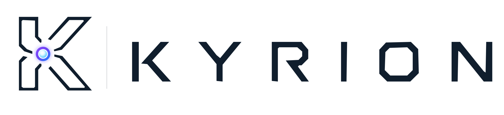

<p align="center">
  <picture>
    <source media="(prefers-color-scheme: dark)" srcset="branding/logo/kyrion-dark.svg">
    <source media="(prefers-color-scheme: light)" srcset="branding/logo/kyrion-light.svg">
    
  </picture>
</p>

# Kyrion

> A local-first orchestration platform for devices, services, automations and
> optional AI.

Kyrion is being developed as an open-source project. It explores how a
personal digital environment can connect smart-home devices, local services,
media, knowledge and AI without giving an AI model direct authority over the
user's systems.

The project is currently a working development prototype, not a finished
consumer product. Several existing vertical slices have real local hardware evidence;
planned capabilities are documented separately and are not presented as
complete.

> **Licence notice:** the source is being prepared for open-source publication,
> but a repository licence has not yet been selected. Until a `LICENSE` file is
> added, the code remains all rights reserved and cannot yet be reused under an
> open-source licence.

## Why Kyrion exists

Personal infrastructure is fragmented across vendor applications, cloud
accounts and incompatible ecosystems. Kyrion aims to provide one coherent,
auditable layer above them while preserving a few non-negotiable boundaries:

- essential functions remain usable without AI;
- local processing and storage are preferred where practical;
- external providers are optional and visible;
- Core, not an LLM, owns permissions and execution decisions;
- integrations expose stable capabilities instead of leaking vendor APIs;
- important actions are validated, correlated and recorded;
- German and English are supported from the beginning.

The guiding rule for AI-assisted actions is:

> **LLM proposes. Core decides. Adapter executes. Result confirms.**

Read the [project vision](docs/vision.md), [principles](docs/principles.md) and
[product strategy](docs/product-strategy.md) for the longer-term direction.

## What works today

The current repository includes the following implemented
slices.

### Platform and security

- local owner setup and authentication;
- owner-issued invitations for additional accounts with shared device control;
- Argon2id password hashing and opaque, hashed session credentials;
- owner-scoped PostgreSQL persistence;
- conversation history and deterministic context compaction;
- explicit, owner-controlled personal memory;
- an append-only activity log with correlation identifiers;
- German and English Web interfaces.

### Devices and integrations

- local Nanoleaf discovery, physical authorisation and encrypted credentials;
- shared local network discovery;
- [Home Assistant device and basic state import](docs/home-assistant-import.md),
  including Shelly/sensor data and mapping into existing rooms (awaiting physical verification);
- retained [experimental direct Shelly H&T code](docs/shelly-integration.md),
  which is not a fully working, physically verified native integration;
- Nanoleaf state, power, brightness, colour, temperature and stored scenes;
- persistent rooms, device names and room assignments;
- a provider-neutral device catalog and bounded command contracts;
- an authenticated Raspberry Pi 5 gateway agent;
- Zigbee discovery and explicit approval through Zigbee2MQTT;
- physical control of two Philips Hue colour lamps through the shared Core
  command path;
- direct discovery, explicit approval and bounded Bluetooth control of a
  physically verified MELK-OA20 colour lamp through the same Core command path;
- explicit `online`, `offline`, `degraded` and `unknown` availability.
- Core-owned Spotify OAuth, Connect-device selection and a [Lounge player](docs/lounge.md)
  for playback control; phone-to-Pi playback is owner-verified, while the new
  Web controls still require live receiver validation;
- YouTube video and playlist links in Lounge, including a YouTube Music link
  entry, using the visible browser player and Core-owned link validation;

### AI and voice

- local streaming chat through a provider-neutral AI service and Ollama;
- bounded German and English device-command proposals;
- a Raspberry Pi Voice Satellite with local `Hey Velora` wake-word inference;
- local VAD, microphone capture and provider-neutral Parakeet transcription;
- authenticated, Core-owned multi-turn voice sessions;
- Bluetooth/PipeWire playback through physical speakers;
- provider-neutral Fixed, Template and Dynamic voice-response plans;
- checksum-pinned reviewed-audio support and an owner-scoped template cache.

The shared Core Action Orchestrator is implemented for Web and Voice. Physical
Voice evidence and remaining acceptance items are recorded separately; software
coverage does not establish repeatable acoustic or device acceptance.

## Current focus

The pre-Velora consolidation covers the bounded HA import, existing System
services diagnostics, provider-neutral device contracts, the Activity execution
inspector and repository hygiene. No HA control or new product domain is added.

Read the [consolidation report](docs/status/2026-09-06-platform-consolidation.md)
and [current TODO](docs/status/TODO.md). The next dedicated Velora phase starts
with the existing processing/audio/device-result order and repeatability
acceptance, using the inspector to distinguish Core decisions from audio issues.
It does not implicitly reopen TTS provider discovery.

## Architecture

```text
Web / Voice Satellite / future Mobile / Automations
                         |
                         v
                    Kyrion Core
       identity | policy | persistence | audit
            target resolution | action decisions
                  /                    \
                 v                      v
       Integration adapters       Optional AI service
       Nanoleaf / Zigbee / ...    STT / proposals / chat / TTS
```

Component ownership is intentional:

- **Web** presents state and collects intent through same-origin routes. It does
  not own provider rules or browser-visible secrets.
- **Kyrion Core** is the Kotlin/Spring Boot authority for authentication,
  ownership, permissions, policy, target resolution, command execution,
  persistence and audit.
- **AI service** is a Python/FastAPI capability provider for language,
  transcription and speech. Its proposals are untrusted until Core validates
  them.
- **Gateway agent** performs only bounded operations authorised by Core and
  reports typed health and device observations.
- **Voice Satellite** owns local wake detection, bounded capture and playback.
  It cannot execute device actions directly.
- **Adapters** translate Kyrion capabilities into provider-specific APIs.
  Home Assistant is an optional read-only device import; it is not the platform
  core.

See [Architecture](docs/architecture.md) and the accepted
[Architecture Decision Records](docs/adr/) for detailed boundaries.

## Repository layout

```text
kyrion/
|-- apps/
|   |-- web/                 Next.js and React Web application
|   |-- website/             independent public website for kyrion.ch
|   `-- mobile/              planned Expo application
|-- services/
|   |-- core/                Kotlin/Spring Boot authority
|   |-- ai/                  Python/FastAPI AI and speech capabilities
|   |-- gateway-agent/       bounded Raspberry Pi gateway runtime
|   `-- voice-satellite/     local wake, capture and playback runtime
|-- packages/
|   `-- api-contracts/       shared/generated contracts scaffold
|-- infrastructure/         local deployment and node configuration
|-- docs/                    architecture, roadmap, ADRs and evidence
`-- README.md
```

## Technology

- Next.js, React and TypeScript;
- Kotlin, Spring Boot and Gradle;
- Python, FastAPI and Pydantic;
- PostgreSQL and Flyway;
- Ollama for replaceable local language-model execution;
- NVIDIA Parakeet behind a provider-neutral local HTTP boundary for speech recognition;
- openWakeWord and ONNX on the Raspberry Pi;
- Zigbee2MQTT and loopback-only Mosquitto for the current Zigbee adapter;
- PipeWire, ALSA and Bluetooth for the Voice Satellite audio path.

Speech runtimes, model weights, private recordings and device credentials are
not treated as ordinary repository assets. Their versions, licences and local
storage boundaries must be reviewed separately.

## Development status and evidence

Kyrion distinguishes five states explicitly:

- **implemented**: present in the repository;
- **automatically tested**: exercised by the reported automated checks;
- **physically verified**: exercised against the documented local hardware;
- **experimental**: isolated code or benchmarks that are not active product
  paths;
- **planned**: architectural direction or roadmap scope not yet implemented.

Useful starting points:

- [Current development status](docs/status/README.md)
- [Current TODO](docs/status/TODO.md)
- [Project roadmap](docs/roadmap.md)
- [Single-file context snapshot](docs/status/CHAT-CONTEXT.md)
- [Development startup](docs/development-startup.md)
- [Hardware roadmap](docs/hardware-roadmap.md)

Several voice-provider and streaming experiments remain in the repository as
reproducible evidence. They are not automatically installed, started or
considered production dependencies.

## Running the project

The independent [public website](apps/website/README.md) runs with
`pnpm install` and `pnpm --filter website dev` from the repository root at
`http://localhost:3001`. It does not require the local platform services.
The root pnpm workspace covers this new application; `apps/web` retains its
existing independent pnpm setup.

Kyrion is not yet packaged for one-command consumer installation. Local
development currently requires the Web application, Core, AI service,
PostgreSQL and selected local providers to be configured independently.

Start with [Local Development Startup](docs/development-startup.md). Hardware
integrations additionally require owner-controlled devices, private local
configuration and explicit enrolment. Never commit credentials, model caches,
private recordings or generated training data.

## Roadmap direction

The immediate handoff is the bounded consolidation described above, followed by
an explicitly scoped Velora phase. Wider integration profiles, backup/restore
orchestration, Matter/Thread, remote access, mobile and public plugins remain
future roadmap items. Spotify and YouTube already have bounded Lounge slices;
they are not new work for this consolidation.

## Contributing

External contribution guidance, issue templates and a code of conduct have not
yet been published. Until those are added, the repository should be considered
an actively developed project shared for transparency and portfolio review.

Architecture and implementation contributions must preserve the boundaries in
[AGENTS.md](AGENTS.md): Core authority, least privilege, provider-neutral
contracts, German/English parity, local-first operation and explicit separation
between implemented and planned functionality.

## Licence

Kyrion is intended to be released as open source, but the licence decision is
still pending. Until a `LICENSE` file is committed, all rights are reserved.
Do not assume permission to copy, modify or redistribute the source yet.
